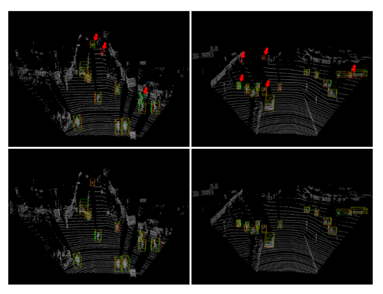

## CEMS & MLGA

This is the open-source code for the paper "Class-Enhanced Multi-Sampling and Multi-Level Graph Attention for 3D Object Detection."



This project is based on OpenPCDet. So please refer to INSTALL.md and GETTING_STARTED.md for the installation and usage, respectively


If you want to try our reproduced IA-SSD, please run the following commands after setting up the environment.
```
python train.py --cfg_file cfgs/once_models/IA-SSD-ctr_aware.yaml 
```
If you wish to try IA-SSD with CEMS and MLGA modules, please use the following commands:
```
python train.py --cfg_file cfgs/once_models/CA-SSD_cams.yaml 
```

[//]: # (The voxel-based code is currently being integrated into the unified project, as it was adapted from the SAFDNet open-source implementation. Please stay tuned for updates.)

If you want to try origin SECOND, please run the following commands after setting up the environment.
```
python train.py --cfg_file --cfg_file cfgs/once_models/second.yaml 
```

If you want to try SECOND with CEMS and MLGA modules, please run the following commands after setting up the environment.
```
python train.py --cfg_file --cfg_file cfgs/once_models/second_with_cems_mlga.yaml 
```

If you want to use the CEMS and MLGA modules in other networks, please refer to the module configuration methods in these two configuration files: second_cems_mlga.yamland CA-SSD_cams.yaml.

